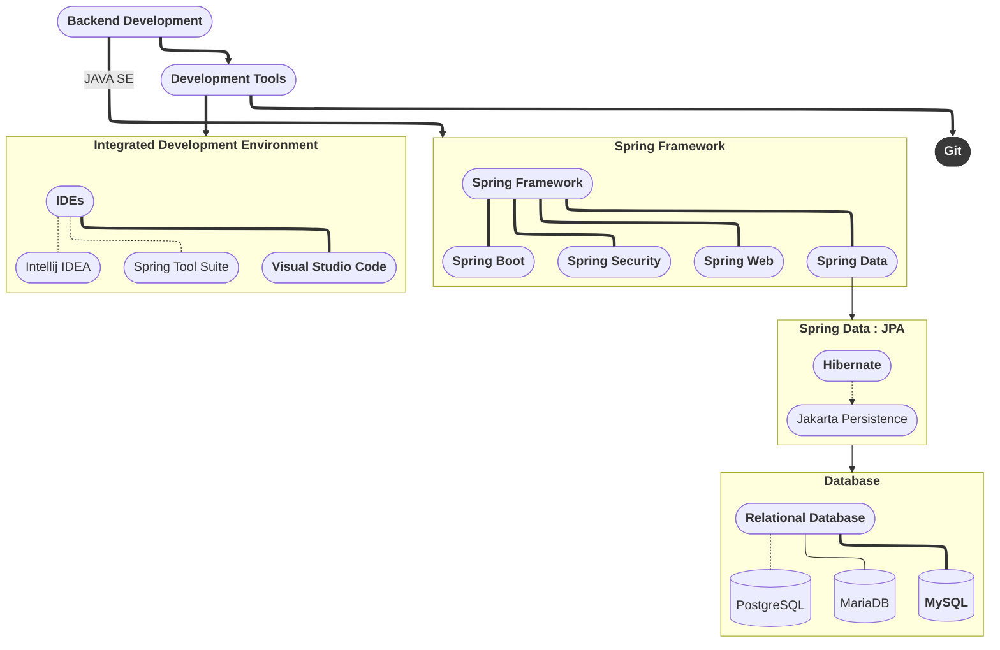

<!-- header gift -->

<!-- Header -->

	<picture>	
		<source media="(prefers-color-scheme: dark)" srcset="https://readme-typing-svg.herokuapp.com?font=Fira+Code&weight=700&pause=7000&duration=6000&color=8DE0F2&lineSpacing=10px&width=500&size=35&lines=Hello%F0%9F%91%8B%2C+I'm+Jair+Lucas">
  		<source media="(prefers-color-scheme: light)" srcset="https://readme-typing-svg.herokuapp.com?font=Fira+Code&weight=700pause=7000&duration=6000&color=010A26&lineSpacing=10px&width=500&size=35&lines=Hello%F0%9F%91%8B%2C+I'm+Jair+Lucas">
  		
	</picture>

<!-- Github Activity -->

	<!-- last commit -->
	<picture>	
		<source media="(prefers-color-scheme: dark)" srcset="https://img.shields.io/github/last-commit/jairlucasbe/jairlucasbe?style=for-the-badge&logo=github&logoWidth=30&labelColor=025159&color=79D0F2">
  		<source media="(prefers-color-scheme: light)" srcset="https://img.shields.io/github/last-commit/jairlucasbe/jairlucasbe?style=for-the-badge&logo=github&logoWidth=30&labelColor=025159&color=038C8C">
  		 &nbsp;
	</picture>
	<!-- commit activity -->
	<picture>	
		<source media="(prefers-color-scheme: dark)" srcset="https://img.shields.io/github/commit-activity/w/jairlucasbe/jairlucasbe?style=for-the-badge&logo=github&logoWidth=30&labelColor=025159&color=79D0F2">
  		<source media="(prefers-color-scheme: light)" srcset="https://img.shields.io/github/commit-activity/w/jairlucasbe/jairlucasbe?style=for-the-badge&logo=github&logoWidth=30&labelColor=025159&color=038C8C">
  		 &nbsp;
	</picture>
	<picture>	
		<source media="(prefers-color-scheme: dark)" srcset="https://badges.pufler.dev/repos/jairlucasbe?style=for-the-badge&logo=github&logoWidth=30&labelColor=025159&color=79D0F2" alt="jairlucasbe">
  		<source media="(prefers-color-scheme: light)" srcset="https://badges.pufler.dev/repos/jairlucasbe?style=for-the-badge&logo=github&logoWidth=30&labelColor=025159&color=038C8C" alt="jairlucasbe">
  		 &nbsp;
	</picture> 

---

<!-- Presentations -->

<h2>Professional Overview</h2>
<h4>
    I'm a Systems Engineer specializing in backend development using &nbsp;  &nbsp; and the &nbsp; . Currently, I am focused on security topics with &nbsp; , &nbsp; while continuing to expand my knowledge in advanced areas such as microservices architecture and other emerging methodologies.
</h4>

 

<!-- Social Networks -->

 
	  &nbsp;&nbsp;
	  &nbsp; &nbsp;
	  &nbsp;&nbsp;
	  &nbsp;&nbsp;
	 

 

<!-- Profile Views -->

 
	   

<!-- My Stack Technology -->
<h2>Stack of Technologies</h2>

<!-- Stack technology icons -->
 

	 <picture>
		<source media="(prefers-color-scheme: dark)" srcset="https://cdn.svgporn.com/logos/java.svg" alt="spring-icon">
  		<source media="(prefers-color-scheme: light)" srcset="https://cdn.svgporn.com/logos/java.svg" alt="spring-icon">
		
	 </picture>
	   
	 <picture>
		 
	 </picture>
	 &nbsp;&nbsp;
	 <picture width="50px">
		 
	 </picture>
	 &nbsp;&nbsp;
	 <picture width="40px">
		 
	 </picture>
	 &nbsp;&nbsp;
	 <picture width="50px">
		 
	 </picture>
 	

<!-- My Stack Technology -->
<h2>Activity Sumary</h2>

<!-- Stats -->

	<!-- Github Simple stats -->
	<picture>
		<source media="(prefers-color-scheme: dark)" srcset="https://streak-stats.demolab.com?user=jairlucasbe&theme=cobalt&hide_border=true&date_format=M%20j%5B%2C%20Y%5D&background=00000000">
  		<source media="(prefers-color-scheme: light)" srcset="https://streak-stats.demolab.com?user=jairlucasbe&theme=highcontrast&hide_border=true&border_radius=30&date_format=M%20j%5B%2C%20Y%5D">
		
	</picture> 
	<!-- Github Colorized stats-->
	<!--<picture>
		<source media="(prefers-color-scheme: dark)" srcset="https://github-readme-stats.vercel.app/api?username=jairlucasbe&hide_border=true&hide=prs%2Cissues&theme=merko&bg_color=00000000&show_icons=true&count_private=true">
  		<source media="(prefers-color-scheme: light)" srcset="https://github-readme-stats.vercel.app/api?username=jairlucasbe&hide=contribs,prs&hide_border=true&theme=chartreuse-dark&bg_color=00000000&show_icons=true&count_private=true">
		
	</picture>-->
	<!-- Github Languages -->
	<!--
  	<picture>
		<source media="(prefers-color-scheme: dark)" srcset="https://github-readme-stats.vercel.app/api/top-langs/?username=jairlucasbe&layout=compact&hide_border=true&theme=algolia&bg_color=00000000">
  		<source media="(prefers-color-scheme: light)" srcset="https://github-readme-stats.vercel.app/api/top-langs/?username=bastndev&layout=compact&hide_border=true&title_color=02D9F7FF&text_color=02D9F7FF&bg_color=0d1117&hide=python">
		
	</picture>-->
	

 

<!-- statistic graph -->

	<picture>
		<source media="(prefers-color-scheme: dark)" srcset="https://github-readme-activity-graph.vercel.app/graph?username=jairlucasbe&area=true&hide_border=true&theme=react&grid=false&bg_color=00000000&title_color=79D0F2">
  		<source media="(prefers-color-scheme: light)" srcset="https://github-readme-activity-graph.vercel.app/graph?username=jairlucasbe&bg_color=0d1117&color=ffffff&line=00b3ff&point=f9fafa&area=true&hide_border=true">
		
	</picture>

<!-- footer gift -->

