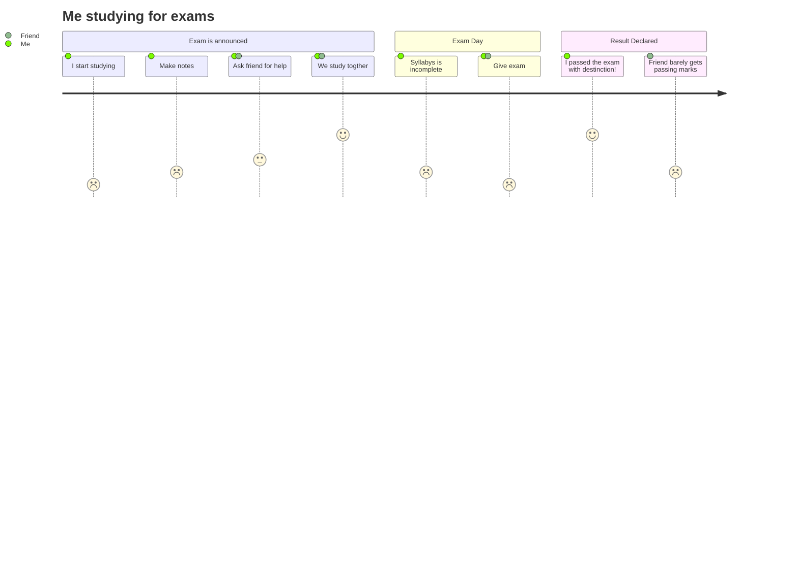

## <!-- Header -->

	<picture>	
		<source media="(prefers-color-scheme: dark)" srcset="https://readme-typing-svg.herokuapp.com?font=Fira+Code&weight=700&pause=300&color=BFA084&lineSpacing=10px&width=435&size=30&lines=Hello%F0%9F%91%8B%2C+I'm+Jair+Lucas">
  		<source media="(prefers-color-scheme: light)" srcset="https://readme-typing-svg.herokuapp.com?font=Fira+Code&weight=700&pause=300&color=020659&lineSpacing=10px&width=435&size=30&lines=Hello%F0%9F%91%8B%2C+I'm+Jair+Lucas">
  		
	</picture>

<!-- Github Activity -->

	
	
	 

<!-- Presentation -->

	
  	<h3 style="color:#FFFFFF; line-height:30px; font-weight:900;">
    Systems Engineer specializing in backend development using &nbsp;&nbsp;
    <img src="https://img.shields.io/badge/java-ff0000?logo=data:image/svg+xml;base64,PD94bWwgdmVyc2lvbj0iMS4wIiBlbmNvZGluZz0iVVRGLTgiIHN0YW5kYWxvbmU9Im5vIj8+Cjxzdmcgd2lkdGg9IjI1NnB4IiBoZWlnaHQ9IjM0NnB4IiB2aWV3Qm94PSIwIDAgMjU2IDM0NiIgdmVyc2lvbj0iMS4xIiB4bWxucz0iaHR0cDovL3d3dy53My5vcmcvMjAwMC9zdmciIHhtbG5zOnhsaW5rPSJodHRwOi8vd3d3LnczLm9yZy8xOTk5L3hsaW5rIiBwcmVzZXJ2ZUFzcGVjdFJhdGlvPSJ4TWlkWU1pZCI+Cgk8Zz4KCQk8cGF0aCBkPSJNODIuNTUzOTQ5MSwyNjcuNDcyNTI0IEM4Mi41NTM5NDkxLDI2Ny40NzI1MjQgNjkuMzU1NTIsMjc1LjE0Nzg2OSA5MS45NDY4MjE4LDI3Ny43NDUxMDUgQzExOS4zMTU1NDksMjgwLjg2NzM3NSAxMzMuMzAzMzg5LDI4MC40MTk2MDcgMTYzLjQ2MzkxMywyNzQuNzExMjczIEMxNjMuNDYzOTEzLDI3NC43MTEyNzMgMTcxLjM5MzM5NiwyNzkuNjgzMjU4IDE4Mi40Njc0OTEsMjgzLjk4OTY0NCBDMTE0Ljg1NTU2NCwzMTIuOTY2OTgyIDI5LjQ0ODM3ODIsMjgyLjMxMTIxNSA4Mi41NTM5NDkxLDI2Ny40NzI1MjQiIGZpbGw9IiNGRkZGRkYiPjwvcGF0aD4KCQk8cGF0aCBkPSJNNzQuMjkyMTMwOSwyMjkuNjU4OTk2IEM3NC4yOTIxMzA5LDIyOS42NTg5OTYgNTkuNDg4ODE0NSwyNDAuNjE2NzI3IDgyLjA5Njg3MjcsMjQyLjk1NTE3MSBDMTExLjMzMzAwNCwyNDUuOTcxMzE2IDEzNC40MjE0MTEsMjQ2LjIxODAwNyAxNzQuMzczMjM2LDIzOC41MjQ5NzUgQzE3NC4zNzMyMzYsMjM4LjUyNDk3NSAxNzkuODk5MTEzLDI0NC4xMjcxODUgMTg4LjU4ODIxOCwyNDcuMTkwODA3IEMxMDYuODQxMzY3LDI3MS4wOTQ2OTEgMTUuNzkwMDgsMjQ5LjA3NTg5OCA3NC4yOTIxMzA5LDIyOS42NTg5OTYiIGZpbGw9IiNGRkZGRkYiPjwvcGF0aD4KCQk8cGF0aCBkPSJNMTQzLjk0MTgxOCwxNjUuNTE0NzA1IEMxNjAuNjAxMzY3LDE4NC42OTUxNTYgMTM5LjU2NDY4NCwyMDEuOTU1MTQyIDEzOS41NjQ2ODQsMjAxLjk1NTE0MiBDMTM5LjU2NDY4NCwyMDEuOTU1MTQyIDE4MS44NjYxMjQsMTgwLjExNzg3NiAxNjIuNDM4OTgyLDE1Mi43NzI0MjIgQzE0NC4yOTQ2MzMsMTI3LjI3MTA5OCAxMzAuMzgwMzM1LDExNC42MDA0OTUgMjA1LjcwNjcwNSw3MC45MTM4NjE4IEMyMDUuNzA2NzA1LDcwLjkxMzg2MTggODcuNDY5MTQ5MSwxMDAuNDQ0MTYgMTQzLjk0MTgxOCwxNjUuNTE0NzA1IiBmaWxsPSIjRkZGRkZGIj48L3BhdGg+CgkJPHBhdGggZD0iTTIzMy4zNjQwMTUsMjk1LjQ0MTY4NyBDMjMzLjM2NDAxNSwyOTUuNDQxNjg3IDI0My4xMzExMTMsMzAzLjQ4OTM5NiAyMjIuNjA3MzYsMzA5LjcxNTMxNiBDMTgzLjU4MDg1OCwzMjEuNTM3ODYyIDYwLjE3NDg5NDUsMzI1LjEwNzg5OCAyNS44OTMyMzY0LDMxMC4xODYzNTYgQzEzLjU2OTg2MTgsMzA0LjgyNTI1MSAzNi42Nzk2OCwyOTcuMzg1NDI1IDQzLjk0OTE0OTEsMjk1LjgyNDI5MSBDNTEuNTMwNDcyNywyOTQuMTgwMzA1IDU1Ljg2MjkyMzYsMjk0LjQ4NjU3NSA1NS44NjI5MjM2LDI5NC40ODY1NzUgQzQyLjE1ODA4LDI4NC44MzIxMTYgLTMyLjcxOTU5MjcsMzEzLjQ0MzYwNyAxNy44Mjg3NzA5LDMyMS42Mzc0NjkgQzE1NS42ODE1MTMsMzQzLjk5MzI1MSAyNjkuMTIxMTY0LDMxMS41NzA2MTggMjMzLjM2NDAxNSwyOTUuNDQxNjg3IiBmaWxsPSIjRkZGRkZGIj48L3BhdGg+CgkJPHBhdGggZD0iTTg4LjkwMDg4NzMsMTkwLjQ3OTgyNSBDODguOTAwODg3MywxOTAuNDc5ODI1IDI2LjEyODc1NjQsMjA1LjM4OTI2NSA2Ni42NzE3MDkxLDIxMC44MDM0MzMgQzgzLjc5MDE5NjQsMjEzLjA5NTMzMSAxMTcuOTE1NDYyLDIxMi41NzY4MTUgMTQ5LjcwMjI4NCwyMDkuOTEzNDg0IEMxNzUuNjgwMjMzLDIwNy43MjIxMjQgMjAxLjc2NTIzNiwyMDMuMDYyOTI0IDIwMS43NjUyMzYsMjAzLjA2MjkyNCBDMjAxLjc2NTIzNiwyMDMuMDYyOTI0IDE5Mi42MDUwOTEsMjA2Ljk4NTc3NSAxODUuOTc3OTQ5LDIxMS41MTA5MjQgQzEyMi4yMzM5NDksMjI4LjI3NTY2NSAtMC45MDc2MzYzNjQsMjIwLjQ3NjUwOSAzNC41NDMyNDM2LDIwMy4zMjgyMzMgQzY0LjUyNDEwMTgsMTg4LjgzNTg0IDg4LjkwMDg4NzMsMTkwLjQ3OTgyNSA4OC45MDA4ODczLDE5MC40Nzk4MjUiIGZpbGw9IiNGRkZGRkYiPjwvcGF0aD4KCQk8cGF0aCBkPSJNMjAxLjUwNjQ0NCwyNTMuNDIyMzEzIEMyNjYuMzA1MTY0LDIxOS43NTA0IDIzNi4zNDQ3ODUsMTg3LjM5MiAyMTUuNDMyODQ0LDE5MS43NTE0NDcgQzIxMC4zMDcyNTgsMTkyLjgxODI2OSAyMDguMDIxODc2LDE5My43NDI2NjIgMjA4LjAyMTg3NiwxOTMuNzQyNjYyIEMyMDguMDIxODc2LDE5My43NDI2NjIgMjA5LjkyNDY1NSwxOTAuNzYxODkxIDIxMy41NTg5MjQsMTg5LjQ3MTY1MSBDMjU0LjkyOTQ1NSwxNzQuOTI3MTI3IDI4Ni43NDYwNjUsMjMyLjM2ODg3MyAyMDAuMjA0MTAyLDI1NS4xMTkzNiBDMjAwLjIwNDEwMiwyNTUuMTIwMjkxIDIwMS4yMDY2OTEsMjU0LjIyMzgyNSAyMDEuNTA2NDQ0LDI1My40MjIzMTMiIGZpbGw9IiNGRkZGRkYiPjwvcGF0aD4KCQk8cGF0aCBkPSJNMTYyLjQzODk4MiwwLjM3MTQzMjcyNyBDMTYyLjQzODk4MiwwLjM3MTQzMjcyNyAxOTguMzI1NTI3LDM2LjI3MDA4IDEyOC40MDIxNTMsOTEuNDcyMDU4MiBDNzIuMzMwNzA1NSwxMzUuNzUzNTQyIDExNS42MTYxMTYsMTYxLjAwMTY1OCAxMjguMzc4ODgsMTg5Ljg0ODY2OSBDOTUuNjQ5MDQ3MywxNjAuMzE4MzcxIDcxLjYyOTczMDksMTM0LjMyMjczNSA4Ny43NDM3NjczLDExMC4xMjg0MDcgQzExMS4zOTUzNzUsNzQuNjEzMjk0NSAxNzYuOTE4MzQyLDU3LjM5NDI2OTEgMTYyLjQzODk4MiwwLjM3MTQzMjcyNyIgZmlsbD0iI0ZGRkZGRiI+PC9wYXRoPgoJCTxwYXRoIGQ9Ik05NS4yNjgzMDU1LDM0NC42NjUzNjcgQzE1Ny40NjY5OTYsMzQ4LjY0Njg2NSAyNTIuOTgwMTMxLDM0Mi40NTYzMiAyNTUuMjQyMjQsMzEzLjAyNTYyOSBDMjU1LjI0MjI0LDMxMy4wMjU2MjkgMjUwLjg5Mzk2NCwzMjQuMTgyNTc1IDIwMy44MzgzNzEsMzMzLjA0Mjk2NyBDMTUwLjc1MDQ4NywzNDMuMDMzNDg0IDg1LjI3NDA2NTUsMzQxLjg2NzA1NSA0Ni40MzkzMzA5LDMzNS40NjQyNjIgQzQ2LjQ0MDI2MTgsMzM1LjQ2MzMzMSA1NC4zODkyOTQ1LDM0Mi4wNDM5MjcgOTUuMjY4MzA1NSwzNDQuNjY1MzY3IiBmaWxsPSIjRkZGRkZGIj48L3BhdGg+Cgk8L2c+Cjwvc3ZnPgo=" alt="java">
    &nbsp;&nbsp;and the &nbsp;&nbsp;  
    
  	</h3>
  	

<!-- Profile Views -->

 
       

</img>

<h2>Project info</h2>

	

<!-- About me -->

-   🔭 I’m currently working on ...
-   🌱 I’m currently learning ...
-   👯 I’m looking to collaborate on ...
-   🤔 I’m looking for help with ...
-   💬 Ask me about ...
-   📫 How to reach me: ...
-   😄 Pronouns: ...
-   ⚡ Fun fact: ...

<!-- end linespace -->
 

