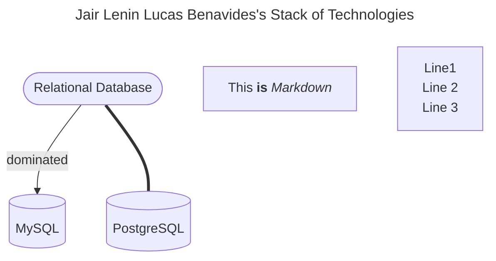
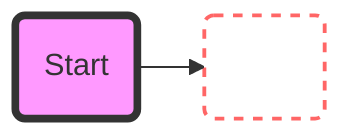
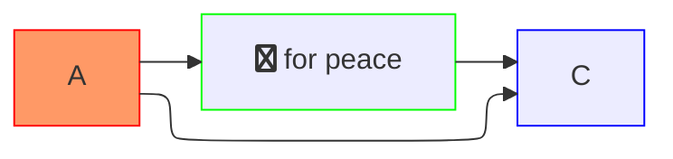

<!-- header gift -->

<!-- Header -->

	<picture>	
		<source media="(prefers-color-scheme: dark)" srcset="https://readme-typing-svg.herokuapp.com?font=Fira+Code&weight=700&pause=7000&duration=6000&color=8DE0F2&lineSpacing=10px&width=500&size=35&lines=Hello%F0%9F%91%8B%2C+I'm+Jair+Lucas">
  		<source media="(prefers-color-scheme: light)" srcset="https://readme-typing-svg.herokuapp.com?font=Fira+Code&weight=700pause=7000&duration=6000&color=010A26&lineSpacing=10px&width=500&size=35&lines=Hello%F0%9F%91%8B%2C+I'm+Jair+Lucas">
  		
	</picture>

<!-- Github Activity -->

	<!-- last commit -->
	<picture>	
		<source media="(prefers-color-scheme: dark)" srcset="https://img.shields.io/github/last-commit/jairlucasbe/jairlucasbe?style=for-the-badge&logo=github&logoWidth=30&labelColor=025159&color=79D0F2">
  		<source media="(prefers-color-scheme: light)" srcset="https://img.shields.io/github/last-commit/jairlucasbe/jairlucasbe?style=for-the-badge&logo=github&logoWidth=30&labelColor=025159&color=038C8C">
  		 &nbsp;
	</picture>
	<!-- commit activity -->
	<picture>	
		<source media="(prefers-color-scheme: dark)" srcset="https://img.shields.io/github/commit-activity/w/jairlucasbe/jairlucasbe?style=for-the-badge&logo=github&logoWidth=30&labelColor=025159&color=79D0F2">
  		<source media="(prefers-color-scheme: light)" srcset="https://img.shields.io/github/commit-activity/w/jairlucasbe/jairlucasbe?style=for-the-badge&logo=github&logoWidth=30&labelColor=025159&color=038C8C">
  		 &nbsp;
	</picture>
	<picture>	
		<source media="(prefers-color-scheme: dark)" srcset="https://badges.pufler.dev/repos/jairlucasbe?style=for-the-badge&logo=github&logoWidth=30&labelColor=025159&color=79D0F2" alt="jairlucasbe">
  		<source media="(prefers-color-scheme: light)" srcset="https://badges.pufler.dev/repos/jairlucasbe?style=for-the-badge&logo=github&logoWidth=30&labelColor=025159&color=038C8C" alt="jairlucasbe">
  		 &nbsp;
	</picture> 

---
<!-- Presentations -->

<h2>Professional Overview</h2>
<h4>
    I'm a Systems Engineer specializing in backend development using &nbsp;  &nbsp; and the &nbsp; . Currently, I am focused on security topics with &nbsp; , &nbsp; while continuing to expand my knowledge in advanced areas such as microservices architecture and other emerging methodologies.
</h4>

 
<!-- Profile Views -->

 
	   

 

<!-- My Stack Technology -->
<h2>Stack of Technologies</h2>

<!-- footer gift -->

