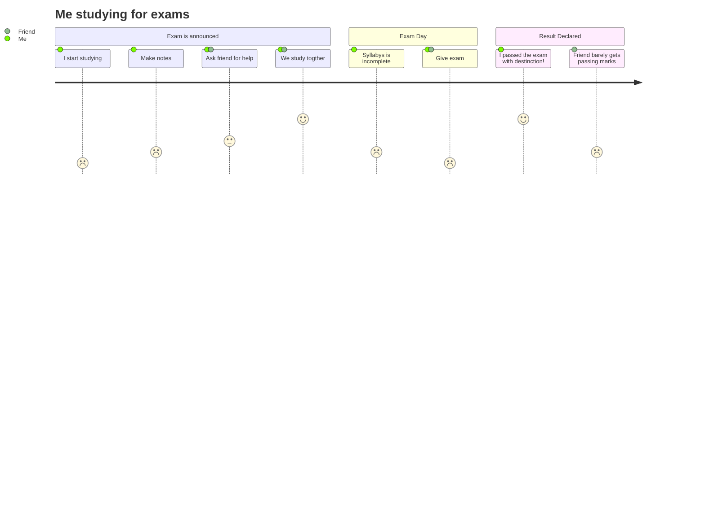

<!-- Header -->
---

	<picture>	
		<source media="(prefers-color-scheme: dark)" srcset="https://readme-typing-svg.herokuapp.com?font=Fira+Code&weight=700&pause=300&color=A3A1EA&lineSpacing=10px&width=435&size=30&lines=Hello%F0%9F%91%8B%2C+I'm+Jair+Lucas">
  		<source media="(prefers-color-scheme: light)" srcset="https://readme-typing-svg.herokuapp.com?font=Fira+Code&weight=700&pause=300&color=020659&lineSpacing=10px&width=435&size=30&lines=Hello%F0%9F%91%8B%2C+I'm+Jair+Lucas">
  		
	</picture>

<!-- Github Activity -->

	
	
	 
	<!---->
	<!---->

	<h3>💻 Systems Engineer with specializing in backend development using Java and the Spring Framework</h3>

<!-- Profile Views -->

 
       

	
	</img>

	</img>

<h2>Project info</h2>

	
	

<!-- About me -->
- 🔭 I’m currently working on ...
- 🌱 I’m currently learning ...
- 👯 I’m looking to collaborate on ...
- 🤔 I’m looking for help with ...
- 💬 Ask me about ...
- 📫 How to reach me: ...
- 😄 Pronouns: ...
- ⚡ Fun fact: ...

<!-- end linespace -->
---

